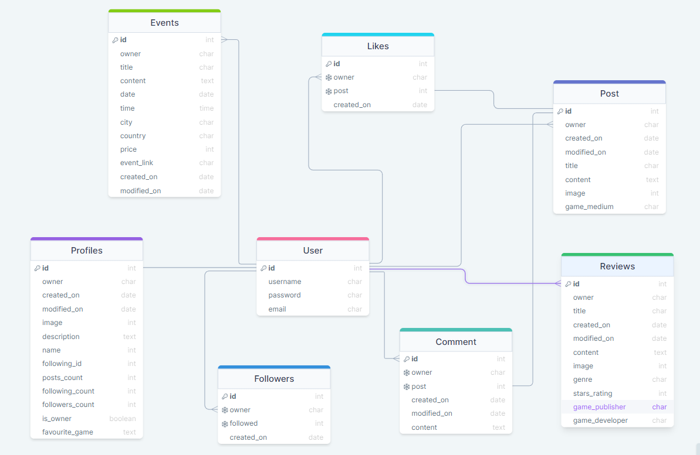

# Gamer Verse - API

## Table of Contents
- [Introduction](#introduction)
- [User Stories](#user-stories)
- [Database Schema](#database-schema)
- [Testing](#testing)
    - [Manual Testing](#manual-testing)
    - [Automated Testing](#automated-testing)
- [Solved Bugs](#solved-bugs)
- [Known Bugs](#known-bugs)
- [Technologies Used](#technologies-used)
    - [Languages Used](#languages-used)
    - [Frameworks, Libraries and Programs](#frameworks-libraries-and-programs)
    - [Databases](#databases)
- [Deployment](#deployment)
    - [Deploying to Heroku](#deploying-to-heroku)
    - [Forking Repository](#forking-repository)
    - [Cloning Repository](#cloning-repository)
- [Credits](#credits)
    - [Code](#code)
    - [Content](#content)
    - [Media](#media)
    - [Resources](#resources)
    - [Acknowledgements](#acknowledgements)

## Introduction
Gamer Verse is a content sharing platform to share reviews, posts and have social interactions with likeminded individuals about games. Users will be able to find posts and reviews relating to the gaming space, along with community events in local cities. This is the backend API database section of the project built to support the ReactJS frontend, and is powered by the Django Rest Framework. 

DEPLOYED API (HEROKU) - [CLICK HERE](https://gamer-verse-drf-api.herokuapp.com/)

DEPLOYED FRONTEND (HEROKU) - CLICK HERE

DEPLOYED FRONTEND REPOSITORY - [CLICK HERE](https://github.com/Jbachtiger/ci-pp5-gamer-verse-drf-api#user-stories)

## User Stories

## Database Schema
DrawSQL was used to create a database schema to visualise the types of custom models this project might require. This schema was used as a guide to what needed to be added to each model.



## Testing

### Manual Testing

### Validator Testing

## Solved Bugs

- Bug 1: 'collections.OrderedDict' object has no attribute 'size'
This error occured when trying to implement validation for image size. The issue was a spelling mistake in the function call. def validate was originally called instead of def validate_image.

- Bug 2: UNIQUE constraint failed: posts_post.owner_id
This error happened as the posts model was set as owner = models.OneToOneField(User, on_delete=models.CASCADE) where as it needed to be owner = models.ForeignKey(User, on_delete=models.CASCADE).

- Bug 3: 'super' object has no attribute 'CREATE'
This error was due to a spelling issue with create being in all capitals and need to be lowercase.

## Known Bugs
None known

## Technologies Used

### Languages Used
- [Python](https://www.python.org/) 

### Frameworks, Libraries and Programs Used
- [Django](https://www.djangoproject.com/)
- [Django REST Framework](https://www.django-rest-framework.org/)
- [Django Rest Auth](https://django-rest-auth.readthedocs.io/en/latest/)
- [Pillow](https://pillow.readthedocs.io/en/stable/)
- [Cors Headers](https://developer.mozilla.org/en-US/docs/Web/HTTP/CORS)
- [Heroku](https://dashboard.heroku.com/apps)
- [GitHub](https://github.com/)
- [Git](https://git-scm.com/)
- [GitPod](https://gitpod.io/projects)
- [Cloudinary](https://cloudinary.com/)
- [DrawSQL](https://drawsql.app/diagrams)
- [Raw Pixel](https://www.rawpixel.com/)

### Databases 
- SQLite: local database used to test during development
- PostgreSQL: database used in Heroku to store data on deployment

## Deployment

### Set up JSON Web Tokens
1. Run terminal command `pip install dj-rest-auth` to install JSON web token authenication
2. Add 'rest_framework.authtoken' and 'dj_rest_auth' to INSTALLED_APPS list in settings.py:
```
INSTALLED_APPS = [
    'django.contrib.admin',
    'django.contrib.auth',
    'django.contrib.contenttypes',
    'django.contrib.sessions',
    'django.contrib.messages',
    'cloudinary_storage',
    'django.contrib.staticfiles',
    'cloudinary',
    'rest_framework',
    'django_filters',
    'rest_framework.authtoken',
    'dj_rest_auth',
```  
3. Add the dj_rest-auth url paths to the main url.py file:
'''
urlpatterns = [
    path('', root_route),
    path('admin/', admin.site.urls),
    path('api-auth/', include('rest_framework.urls')),
    path('dj-rest-auth/', include('dj_rest_auth.urls')),
'''
4. Run terminal command `python manage.py migrate` to migrate database
5. Install Django AllAuth with terminal command `pip install dj-rest-auth[with_social]` for user registration set up
6. Add below INSTALLED_APPS to settings.py:
```
'django.contrib.sites',
    'allauth',
    'allauth.account',
    'allauth.socialaccount',
    'dj_rest_auth.registration',
```
7. Set the SITE_ID in settings.py:
```
SITE_ID = 1
```
8. Add below registration url to main urls.py file:
``` 
path(
        'dj-rest-auth/registration/', include('dj_rest_auth.registration.urls')
    ),
```
9. Run command `pip install djangorestframework-simplejwt` to install JSON tokens
10. In env.py set [DEV] variable:
```
os.environ['DEV'] = '1'
```
11. Add below code to settings.py to check if your project is in development or production:
```
REST_FRAMEWORK = {
    'DEFAULT_AUTHENTICATION_CLASSES': [(
        'rest_framework.authentication.SessionAuthentication'
        if 'DEV' in os.environ
        else 'dj_rest_auth.jwt_auth.JWTCookieAuthentication'
    )],
```
12. Set REST_USE_JWT to enable token authentication:
```
REST_USE_JWT = True
```
13. Set JWT_AUTH_SECURE to ensure tokens are only sent over secure HTTPS:
```
JWT_AUTH_SECURE = True
```
14. Set Cookies for access token and refresh token:
```
JWT_AUTH_COOKIE = 'my-app-auth'
JWT_AUTH_REFRESH_COOKIE = 'my-refresh-token'
```
15. Create a serializers.py file in your main drf directory e.g. pp5_gamer_verse_drf_api and copy the UserDetailsSerializer code from the Django documentation:
```
from dj_rest_auth.serializers import UserDetailsSerializer
from rest_framework import serializers


class CurrentUserSerializer(UserDetailsSerializer):
    """Serializer for Current User"""
    profile_id = serializers.ReadOnlyField(source='profile.id')
    profile_image = serializers.ReadOnlyField(source='profile.image.url')

    class Meta(UserDetailsSerializer.Meta):
        """Meta class to to specify fields"""
        fields = UserDetailsSerializer.Meta.fields + (
            'profile_id', 'profile_image'
        )
``` 
16. Overwrite the default user detail serializer in settings.py:
```
REST_AUTH_SERIALIZERS = {
    'USER_DETAILS_SERIALIZER': 'drf_api.serializers.CurrentUserSerializer'
}
```
17. Run terminal command `python manage.py migrate` to migrate database again
18. Run terminal command `pip freeze > requirements.txt` to update your requirements.txt file with the latest packages
19. `git add`, `git commit -m "Message"` and `git push` changes

### Deploying to Heroku

### Forking Repository
You can fork the GitHub repository to make a copy of the original to view and change without affecting the original. This can be done by:

1. Log into GitHub or create an account
2. Locate the repository at https://github.com/Jbachtiger/ci-pp5-gamer-verse-drf-api
3. At the top of the repository, on the right-hand side of the page you will see an option to select "Fork" from the available buttons
4. Click the fork button and a copy of the repository will have been created

### Cloning Repository
You can create a clone of your repository by:

1. Locate the repository you wish to clone https://github.com/Jbachtiger/ci-pp5-gamer-verse
2. Click the arrow on the 'Code' button at the top of the list of files
3. Select the clone by https and copy the URL using the provided clipboard
4. Navigate to your chosen code editor and within the terminal change the directory to the location your to clone the repository to
5. Type 'git clone' and paste the https link you copied from GitHub
6. Press enter and git will clone the repository to your local machine

## Credits 

### Media
- [RawPixel](https://www.rawpixel.com/) was used to source the default profile and post images 

### Resources
- The Code Institute DRF-API walkthrough was used as a guide on how to build a DRF-API 
- Slack Community

### Acknowledgements
- My partner for her patience and continuing support


