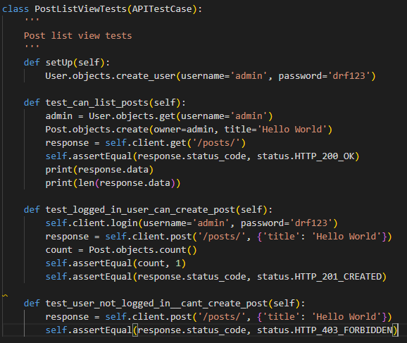
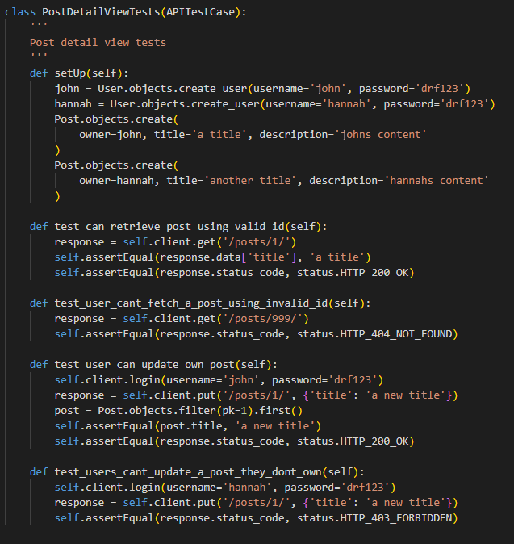
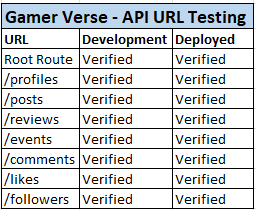
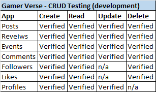
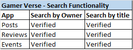

# Gamer Verse - API

## Table of Contents
- [Introduction](#introduction)
- [User Stories](#user-stories)
- [Database Schema](#database-schema)
- [Testing](#testing)
    - [Manual Testing](#manual-testing)
    - [Validator Testing](#validator-testing)
- [Solved Bugs](#solved-bugs)
- [Known Bugs](#known-bugs)
- [Technologies Used](#technologies-used)
    - [Languages Used](#languages-used)
    - [Frameworks, Libraries and Programs](#frameworks-libraries-and-programs)
    - [Databases](#databases)
- [Deployment](#deployment)
    - [Deploying to Heroku](#deploying-to-heroku)
    - [Forking Repository](#forking-repository)
    - [Cloning Repository](#cloning-repository)
- [Credits](#credits)
    - [Code](#code)
    - [Content](#content)
    - [Media](#media)
    - [Resources](#resources)
    - [Acknowledgements](#acknowledgements)

## Introduction
Gamer Verse is a content sharing platform to share reviews, posts and have social interactions with likeminded individuals about games. Users will be able to find posts and reviews relating to the gaming space, along with community events in local cities. This is the backend API database section of the project built to support the ReactJS frontend, and is powered by the Django Rest Framework. 

DEPLOYED API (HEROKU) - [CLICK HERE](https://gamer-verse-drf-api.herokuapp.com/)

DEPLOYED FRONTEND (HEROKU) - CLICK HERE

DEPLOYED FRONTEND REPOSITORY - [CLICK HERE](https://github.com/Jbachtiger/ci-pp5-gamer-verse-drf-api#user-stories)

## User Stories

## Database Schema
DrawSQL was used to create a database schema to visualise the types of custom models this project might require. This schema was used as a guide to what needed to be added to each model.


## Testing

### Automated Tests
The following unit tests have been created:

### Post List View


### Post List View


### Manual Testing
#### URL Testing
All urls have been tested for the development and deployed API and work as expected.



#### CRUD Functionality Testing
CRUD functionality has been tested in each app via the development version including Posts, Reviews, Events, Comments, Followers, Likes, Profiles. This was test by going to each link, creating new items, checking the new item url path, eidting an item (not available for Like, Followers or Users) and deleting an item (not avaiable for Users or Profiles). Results below:



#### Search Functionality Testing
Tested search feature for Posts, Reviews and Events app ensuring filtering worked on all.



### Validator Testing
The website [pep8online.com](pep8online.com) is down therefore, I followed the recommendation from the Code Institute staff to add the PEP8 validator directly to my Gitpod workspace to validate my python code.

1. Run the command `pip3 install pycodestyle`  Note that this extension may already be installed, in which case this command will do nothing
2. In your workspace, press Ctrl+Shift+P (or Cmd+Shift+P on Mac)
3. Type the word `linter` into the search bar that appears, and click on `Python: Select Linter` from the filtered results
4. Select `pycodestyle` from the list
5. PEP8 errors will now be underlined in red, as well as being listed in the PROBLEMS tab beside your terminal


## Solved Bugs

- Bug 1: 'collections.OrderedDict' object has no attribute 'size'
This error occured when trying to implement validation for image size. The issue was a spelling mistake in the function call. def validate was originally called instead of def validate_image.

- Bug 2: UNIQUE constraint failed: posts_post.owner_id
This error happened as the posts model was set as owner = models.OneToOneField(User, on_delete=models.CASCADE) where as it needed to be owner = models.ForeignKey(User, on_delete=models.CASCADE).

- Bug 3: 'super' object has no attribute 'CREATE'
This error was due to a spelling issue with create being in all capitals and need to be lowercase.

## Known Bugs
None known

## Technologies Used

### Languages Used
- [Python](https://www.python.org/) 

### Frameworks, Libraries and Programs Used
- [Django](https://www.djangoproject.com/)
- [Django REST Framework](https://www.django-rest-framework.org/)
- [Django Rest Auth](https://django-rest-auth.readthedocs.io/en/latest/)
- [Pillow](https://pillow.readthedocs.io/en/stable/)
- [Cors Headers](https://developer.mozilla.org/en-US/docs/Web/HTTP/CORS)
- [Heroku](https://dashboard.heroku.com/apps)
- [GitHub](https://github.com/)
- [Git](https://git-scm.com/)
- [GitPod](https://gitpod.io/projects)
- [Cloudinary](https://cloudinary.com/)
- [DrawSQL](https://drawsql.app/diagrams)
- [Raw Pixel](https://www.rawpixel.com/)

### Databases 
- SQLite: local database used to test during development
- PostgreSQL: database used in Heroku to store data on deployment

## Deployment

### Set up JSON Web Tokens
1. Run terminal command `pip install dj-rest-auth` to install JSON web token authenication
2. Add 'rest_framework.authtoken' and 'dj_rest_auth' to INSTALLED_APPS list in settings.py:
```
INSTALLED_APPS = [
    'django.contrib.admin',
    'django.contrib.auth',
    'django.contrib.contenttypes',
    'django.contrib.sessions',
    'django.contrib.messages',
    'cloudinary_storage',
    'django.contrib.staticfiles',
    'cloudinary',
    'rest_framework',
    'django_filters',
    'rest_framework.authtoken',
    'dj_rest_auth',
```  
3. Add the dj_rest-auth url paths to the main url.py file:
'''
urlpatterns = [
    path('', root_route),
    path('admin/', admin.site.urls),
    path('api-auth/', include('rest_framework.urls')),
    path('dj-rest-auth/', include('dj_rest_auth.urls')),
'''
4. Run terminal command `python manage.py migrate` to migrate database
5. Install Django AllAuth with terminal command `pip install dj-rest-auth[with_social]` for user registration set up
6. Add below INSTALLED_APPS to settings.py:
```
'django.contrib.sites',
    'allauth',
    'allauth.account',
    'allauth.socialaccount',
    'dj_rest_auth.registration',
```
7. Set the SITE_ID in settings.py:
```
SITE_ID = 1
```
8. Add below registration url to main urls.py file:
``` 
path(
        'dj-rest-auth/registration/', include('dj_rest_auth.registration.urls')
    ),
```
9. Run command `pip install djangorestframework-simplejwt` to install JSON tokens
10. In env.py set [DEV] variable:
```
os.environ['DEV'] = '1'
```
11. Add below code to settings.py to check if your project is in development or production:
```
REST_FRAMEWORK = {
    'DEFAULT_AUTHENTICATION_CLASSES': [(
        'rest_framework.authentication.SessionAuthentication'
        if 'DEV' in os.environ
        else 'dj_rest_auth.jwt_auth.JWTCookieAuthentication'
    )],
```
12. Set REST_USE_JWT to enable token authentication:
```
REST_USE_JWT = True
```
13. Set JWT_AUTH_SECURE to ensure tokens are only sent over secure HTTPS:
```
JWT_AUTH_SECURE = True
```
14. Set Cookies for access token and refresh token:
```
JWT_AUTH_COOKIE = 'my-app-auth'
JWT_AUTH_REFRESH_COOKIE = 'my-refresh-token'
```
15. Create a serializers.py file in your main drf directory e.g. pp5_gamer_verse_drf_api and copy the UserDetailsSerializer code from the Django documentation:
```
from dj_rest_auth.serializers import UserDetailsSerializer
from rest_framework import serializers


class CurrentUserSerializer(UserDetailsSerializer):
    """Serializer for Current User"""
    profile_id = serializers.ReadOnlyField(source='profile.id')
    profile_image = serializers.ReadOnlyField(source='profile.image.url')

    class Meta(UserDetailsSerializer.Meta):
        """Meta class to to specify fields"""
        fields = UserDetailsSerializer.Meta.fields + (
            'profile_id', 'profile_image'
        )
``` 
16. Overwrite the default user detail serializer in settings.py:
```
REST_AUTH_SERIALIZERS = {
    'USER_DETAILS_SERIALIZER': 'drf_api.serializers.CurrentUserSerializer'
}
```
17. Run terminal command `python manage.py migrate` to migrate database again
18. Run terminal command `pip freeze > requirements.txt` to update your requirements.txt file with the latest packages
19. `git add .`, `git commit -m "Message"` and `git push` changes

### Deploying to Heroku
1. Commit all changes and push them to GitHub
2. Log in to Heroku or create a new account
3. From the Heroku dashboard click the "Create New App" button
4. Enter the name of your app and the region you're located in. Then click "Create App". It is worth noting that your app name must be unique for Heroku to accept it
5. In your app go to the Resources tab and add a Heroku Postgres database. This can be done by searching for Postgres in the Add-ons search box, select Heroku Postgres and choose the HobbyDev - Free option and submit
6. Click on the "Settings" tab and scroll down to reveal config vars and confirm the database URL is there
7. Navigate back to your code in GitPod or whatever IDE your using. Run terminal command `pip install dj_database_url psycogpg2` to install libraries needed to used Heroku PostgreSQL database
8. Import dj_database_url to settings.py:
```
import dj_database_url
```
9. In settings.py, navigate to the DATABASES section and seperate the development and production environments:
```
DATABASES = {
    'default': ({
        'ENGINE': 'django.db.backends.sqlite3',
        'NAME': BASE_DIR / 'db.sqlite3',
    } if 'DEV' in os.environ else dj_database_url.parse(
        os.environ.get('DATABASE_URL')
    ))
}
```
10. Run terminal command `pip install gunicorn` to install the Gunicorn library
11. Add a Procfile to the root directory and add the below code to it:
```
release: python manage.py makemigrations && python manage.py migrate
web: gunicorn pp5_gamer_verse_drf_api.wsgi
```
12. Add the following ALLOWED_HOSTS in settings.py:
```
ALLOWED_HOSTS = [
    os.environ.get('ALLOWED_HOST'),
    'localhost',
]
```
13. Run terminal command `pip install django-cors-headers` to install cors headers library
14. Add 'corsheaders' to INSTALLED_APPS in settings.py:
```
INSTALLED_APPS = [
    'django.contrib.admin',
    'django.contrib.auth',
    'django.contrib.contenttypes',
    'django.contrib.sessions',
    'django.contrib.messages',
    'cloudinary_storage',
    'django.contrib.staticfiles',
    'cloudinary',
    'rest_framework',
    'django_filters',
    'rest_framework.authtoken',
    'dj_rest_auth',
    'django.contrib.sites',
    'allauth',
    'allauth.account',
    'allauth.socialaccount',
    'dj_rest_auth.registration',
    'corsheaders',
```
15. Add corsheaders middleware to the top of MIDDLEWARE in settings.py:
```
MIDDLEWARE = [
    'corsheaders.middleware.CorsMiddleware',
    'django.middleware.security.SecurityMiddleware',
    'django.contrib.sessions.middleware.SessionMiddleware',
    'django.middleware.common.CommonMiddleware',
    'django.middleware.csrf.CsrfViewMiddleware',
    'django.contrib.auth.middleware.AuthenticationMiddleware',
    'django.contrib.messages.middleware.MessageMiddleware',
    'django.middleware.clickjacking.XFrameOptionsMiddleware',
]
```
16. Set cors allowed origins for network requests in settings.py:
```
if 'CLIENT_ORIGIN' in os.environ:
     CORS_ALLOWED_ORIGINS = [
         os.environ.get('CLIENT_ORIGIN'),
         os.environ.get('CLIENT_ORIGIN_DEV')
    ]

else:
    CORS_ALLOWED_ORIGIN_REGEXES = [
         r"^https://.*\.gitpod\.io$",
    ]

CORS_ALLOW_CREDENTIALS = True
```
17. Set JWT_AUTH_SAMESITE to 'None' in settings.py (with the other JWT settings) as follows:
```
JWT_AUTH_SAMESITE = 'None'
```
18. Navigate to env.py and set a SECRET_KEY value. It should be random, long, include lots of different characters and not shared:

```
os.environ['SECRET_KEY'] = 'YOUR SECRET KEY HERE'
```
19. Navigate to settings.py and replace the default SECRET_KEY with:
```
SECRET_KEY = os.environ.get('SECRET_KEY')
```
20. In settings.py set DEBUG:
```
DEBUG = 'DEV' in os.environ
```
21. Copy the CLOUDINARY_URL and SECRET_KEY values from env.py and add them to Heroku config vars
22. Add COLLECT_STATIC to config vars and set to 1
23. Back in your GitPod terminal run command `pip freeze > requirements.txt` to update the requirements.txt file with the new dependencies
24. `git add .`, `git commit -m "Your message"`, `git push`
25. In Heroku go to the "Deploy" tab and scroll down to the "Deployment Method" section
26. Select "GitHub" as the method and click "Connect to GitHub"
27. Scroll down to the "Connet to GitHub" section and search for the repository name you wish to deploy. Do this by typing in the depository name and click the "Search button
28. Once the repository has been found, connect it by clicking the "Connect" button next to its name
29. Choose "Automatic deploys" or "Manual deploys" to deploy your application - watch the build logs for any errors
30. Heroku will now build the app for you. Once it has completed the build process you will see a 'Your App Was Successfully Deployed' message and a link to the app to visit the live site

### dj_rest-auth bug fix
dj-rest-auth currently has a bug where user are unable to log out. To fix this issues, please follow these steps.

1. In your main drf project e.g. pp5_gamer_verse_drf_api, navigate to the view.py file
2. Import JWT_AUTH settings from settings.py:
```
from .settings import (
    JWT_AUTH_COOKIE, JWT_AUTH_REFRESH_COOKIE, JWT_AUTH_SAMESITE,
    JWT_AUTH_SECURE,
)
```
3. Add the below logout code:
```
@api_view(['POST'])
def logout_route(request):
    response = Response()
    response.set_cookie(
        key=JWT_AUTH_COOKIE,
        value='',
        httponly=True,
        expires='Thu, 01 Jan 1970 00:00:00 GMT',
        max_age=0,
        samesite=JWT_AUTH_SAMESITE,
        secure=JWT_AUTH_SECURE,
    )
    response.set_cookie(
        key=JWT_AUTH_REFRESH_COOKIE,
        value='',
        httponly=True,
        expires='Thu, 01 Jan 1970 00:00:00 GMT',
        max_age=0,
        samesite=JWT_AUTH_SAMESITE,
        secure=JWT_AUTH_SECURE,
    )
    return response
```
4. In the main urls.py file, import logout_route:
```
from .views import root_route, logout_route
```
5. Add the following urls to the urlspattern list ensuring to place them above the default dj-rest-urls
```
    path('dj-rest-auth/logout/', logout_route),
    path('dj-rest-auth/', include('dj_rest_auth.urls')),
```
6. `git add .`, `git commit -m "Your message"`, `git push`
7. Navigate back to Heroku and redeploy your app if using manual deployment

### Frontend Environment Variables
This section show what needs to be added for the API to work with the frontend React part of the project.

1. In settings.py, add your Heroku app url to ALLOWED_HOSTS:
```
ALLOWED_HOSTS = [
    '....herokuapp.com'
    'localhost',
]
```
2. Navigate to your Heroku deployed app and go to settings then reveal the config vars
3. Add ALLOWED_HOST key with the value of your deployed URL(same as the one in ALLOWED_HOSTS in settings.py)
4. Navigate back to settings.py and replace the url string with ALLOWED_HOST for your app url
```
ALLOWED_HOSTS = [
    os.environ.get('ALLOWED_HOST'),
    'localhost',
]
```
5. Import regular expression module at the top of settings.py:
```
import re
```
6. Replace the if/else statement for CLIENT_ORIGIN with the following:
```
if 'CLIENT_ORIGIN_DEV' in os.environ:
    extracted_url = re.match(r'^.+-', os.environ.get('CLIENT_ORIGIN_DEV', ''), re.IGNORECASE).group(0)
    CORS_ALLOWED_ORIGIN_REGEXES = [
        rf"{extracted_url}(eu|us)\d+\w\.gitpod\.io$",
    ]
```
7. `git add .`, `git commit -m"Your message"`, `git push`
8. In Heroku, manually deploy app one last time

### Forking Repository
You can fork the GitHub repository to make a copy of the original to view and change without affecting the original. This can be done by:

1. Log into GitHub or create an account
2. Locate the repository at https://github.com/Jbachtiger/ci-pp5-gamer-verse-drf-api
3. At the top of the repository, on the right-hand side of the page you will see an option to select "Fork" from the available buttons
4. Click the fork button and a copy of the repository will have been created

### Cloning Repository
You can create a clone of your repository by:

1. Locate the repository you wish to clone https://github.com/Jbachtiger/ci-pp5-gamer-verse
2. Click the arrow on the 'Code' button at the top of the list of files
3. Select the clone by https and copy the URL using the provided clipboard
4. Navigate to your chosen code editor and within the terminal change the directory to the location your to clone the repository to
5. Type 'git clone' and paste the https link you copied from GitHub
6. Press enter and git will clone the repository to your local machine

## Credits 

### Media
- [RawPixel](https://www.rawpixel.com/) was used to source the default profile and post images 

### Resources
- The Code Institute DRF-API walkthrough was used as a guide on how to build a DRF-API 
- Slack Community
- Kevin at Code Institute for PEP8 validator instructions

### Acknowledgements
- My partner for her patience and continuing support


