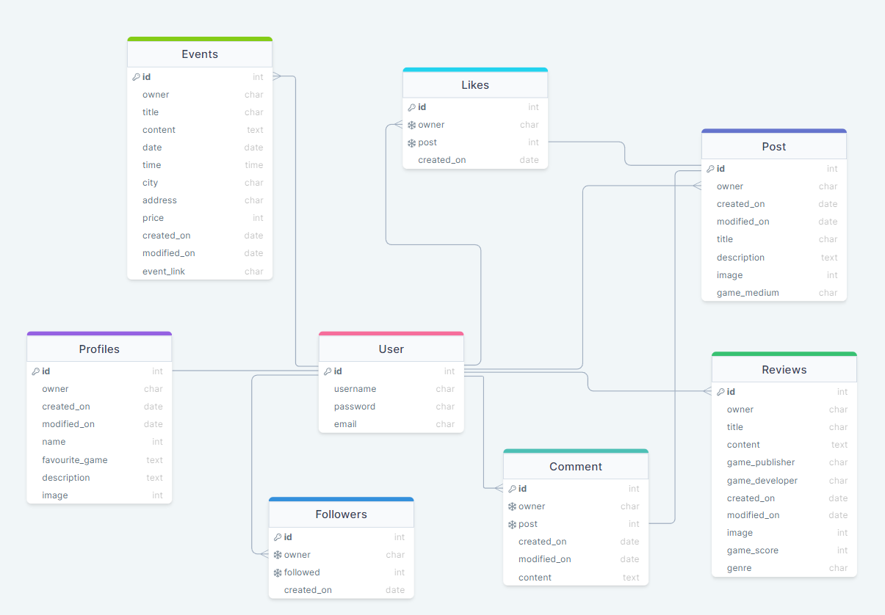

# Gamer Verse - API

## Table of Contents
- [Introduction](#introduction)
- [User Stories](#user-stories)
- [Database Schema](#database-schema)
- [Testing](#testing)
    - [Manual Testing](#manual-testing)
    - [Automated Testing](#automated-testing)
- [Solved Bugs](#solved-bugs)
- [Known Bugs](#known-bugs)
- [Technologies Used](#technologies-used)
    - [Languages Used](#languages-used)
    - [Frameworks, Libraries and Programs](#frameworks-libraries-and-programs)
    - [Databases](#databases)
- [Deployment](#deployment)
    - [Deploying to Heroku](#deploying-to-heroku)
    - [Forking Repository](#forking-repository)
    - [Cloning Repository](#cloning-repository)
- [Credits](#credits)
    - [Code](#code)
    - [Content](#content)
    - [Media](#media)
    - [Resources](#resources)
    - [Acknowledgements](#acknowledgements)

## Introduction
Gamer Verse is a content sharing platform to share reviews, posts and have social interactions with likeminded individuals about games. Users will be able to find posts and reviews relating to the gaming space, along with community events in local cities. This is the backend API database section of the project built to support the ReactJS frontend, and is powered by the Django Rest Framework. 

DEPLOYED API (HEROKU) - [CLICK HERE](https://gamer-verse-drf-api.herokuapp.com/)

DEPLOYED FRONTEND (HEROKU) - CLICK HERE

DEPLOYED FRONTEND REPOSITORY - [CLICK HERE](https://github.com/Jbachtiger/ci-pp5-gamer-verse-drf-api#user-stories)

## User Stories

## Database Schema
DrawSQL was used to create a database schema to visualise the types of custom models this project might require. This schema was used as a guide to what needed to be added to each model.

## Testing

### Manual Testing

### Automated Testing

## Solved Bugs

'collections.OrderedDict' object has no attribute 'size' - this error occured when trying to implement validation for image size. The issue was that the function was called def validate instead of def validate_image

UNIQUE constraint failed: posts_post.owner_id - model set as owner = models.OneToOneField(User, on_delete=models.CASCADE), should be owner = models.ForeignKey(User, on_delete=models.CASCADE)

'super' object has no attribute 'CREATE' - create was in all capitals

## Known Bugs

## Technologies Used

### Languages Used

### Frameworks

### Databases 

## Deployment

### Deploying to Heroku

### Forking Repository

### Cloning Repository

## Credits 

### Code

### Content

### Media

### Resources

### Acknowledgements

